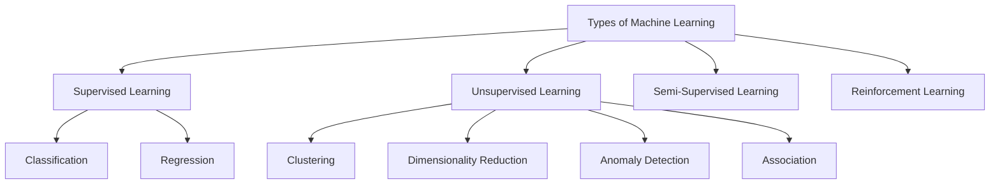
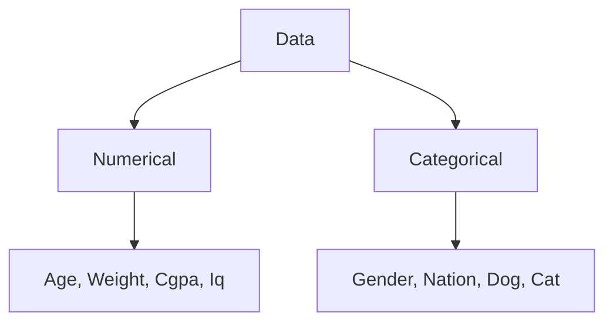
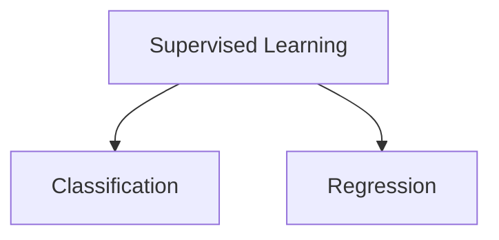

# # What is Machine Learning ??

Machin leraning is a field of computer science that uses statistical techniques to give computer systems the ability to "learn" with data, without being explicitly programmed.  

# # AI Vs ML Vs DL

## Key Differences

| Category | Description |
|--------|-------------|
| **AI (Artificial Intelligence)** | Smart application that can perform its own task without any human intervention |
| **ML (Machine Learning)** | Provides statistical tools to analyze, visualize, build predictive models, and perform forecasting |
| **DL (Deep Learning)** | Mimics the human brain using multi-layered neural networks |
| **Data Scientist** | – |

---

### Examples

- **AI**:  Self-driving cars, Robots, Alexa  

- **ML**:  Object Detection, Image Recognition, Chatbots  

- **DL**:   –  

- **Data Scientist**:  –  

---

### Real-World Applications

- **Amazon.in** → Product Recommendation System  
- **Netflix** → Product Recommendation System  

# # Types of Machine Learning

## 1. Supervised Machine Learning

A machine learning technique in which a model is trained using labeled data, where each input is associated with a known output, so that the model can learn to predict correct outputs for new, unseen inputs.

## Types of Data

## Types of Supervised Machine Learning

### 1. Classification 

